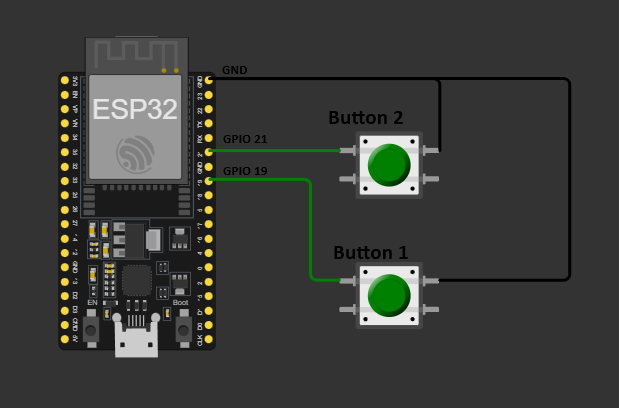

# ESP32 Switches

This project is designed to work with the [Switch Controller App](https://github.com/Donkaos501/SwitchController).  
It allows an **ESP32 microcontroller** to send button press events to the Switch Controller, which then triggers actions such as turning on a light via **Home Assistant**.

## Wiring Diagram


## Sending Requests from ESP32 to the Switch Controller App

The ESP32 can send HTTP POST requests to the **Switch Controller App** to trigger different switch actions.

```http
# Trigger switch 1 (short press)
POST http://localhost:8080/esp
Content-Type: application/json

{
  "uuid": "bd4a6037-0864-4b0e-80e1-8d1c87bf9aa0",
  "friendly_name": "Küche hinten",
  "ip": "192.168.101.181",
  "action": "switch_1_short"
}

# Trigger switch 1 (long press)
POST http://localhost:8080/esp
Content-Type: application/json

{
  "uuid": "bd4a6037-0864-4b0e-80e1-8d1c87bf9aa0",
  "friendly_name": "Küche hinten",
  "ip": "192.168.101.181",
  "action": "switch_1_long"
}

# Trigger switch 2 (short press)
POST http://localhost:8080/esp
Content-Type: application/json

{
  "uuid": "bd4a6037-0864-4b0e-80e1-8d1c87bf9aa0",
  "friendly_name": "Küche hinten",
  "ip": "192.168.101.181",
  "action": "switch_2_short"
}

# Trigger switch 2 (long press)
POST http://localhost:8080/esp
Content-Type: application/json

{
  "uuid": "bd4a6037-0864-4b0e-80e1-8d1c87bf9aa0",
  "friendly_name": "Küche hinten",
  "ip": "192.168.101.181",
  "action": "switch_2_long"
}
```

## How It Works
1. **Button Press on ESP32** → The ESP32 detects the button press event.
2. **Sends an HTTP Request** → The ESP32 sends a request to the **Switch Controller App**.
3. **Action Execution** → The Switch Controller App triggers the appropriate action (e.g., turning on a light in **Home Assistant**).


---

This setup allows for easy integration with **smart home automation**, making it a great way to trigger **Home Assistant scenes, automations, or direct device control** using physical buttons.

